<div align="center">
  <h1> ☕ Coffee Shop App </h1>
  <p><b>A premium Coffee Commerce application with Firebase Auth, Paymob integration, and advanced animations.</b></p>
</div>

<br />

## 📱 Project Overview
This Coffee Shop application is a feature-rich Flutter project developed to demonstrate high-level mobile development skills. It integrates **Firebase** for authentication, **Paymob** for secure payments, and utilizes the **Bloc/Cubit** pattern for state management. The UI features a unique **Zoom Drawer** and **Curved Navigation** for a premium user experience.

---

## 🚀 App Screens

<table>
<tr>
  <td>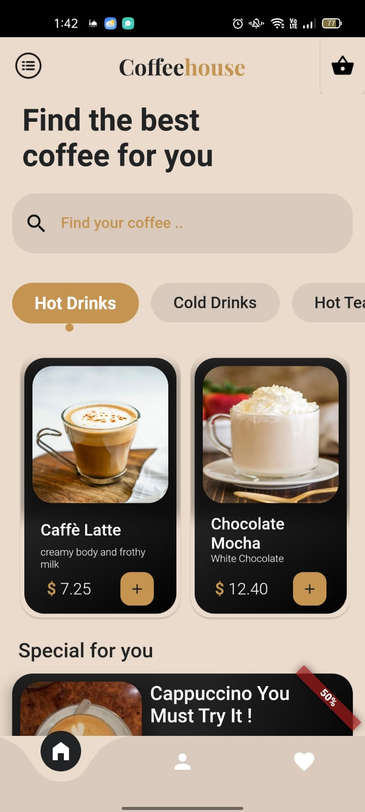</td>
  <td>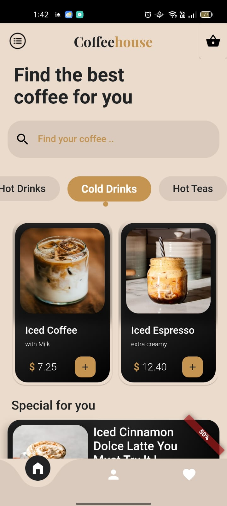</td>
  <td>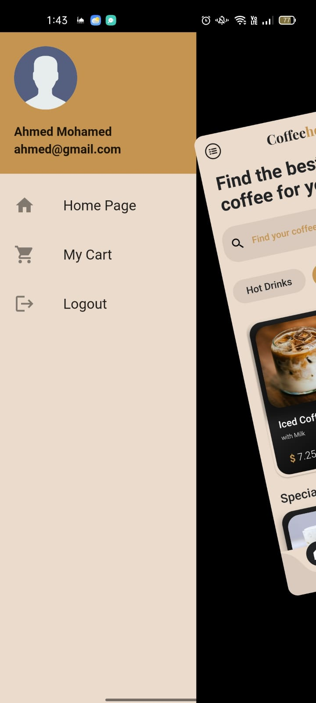</td>
  <td>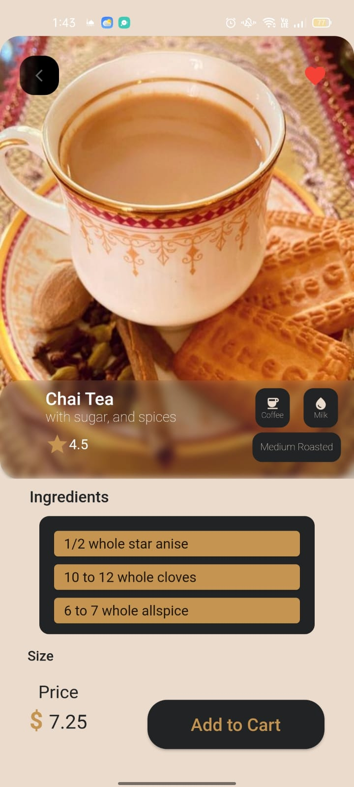</td>
</tr>
<tr>
  <td>Home Screen</td>
  <td>Home Screen 2</td>
  <td>Zoom Drawer Menu</td>
  <td>Product Details</td>
</tr>

<tr>
  <td>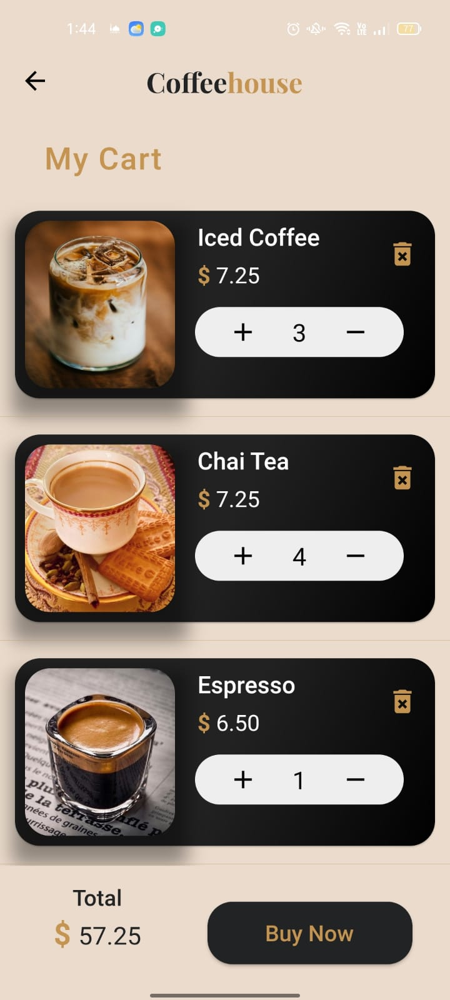</td>
  <td>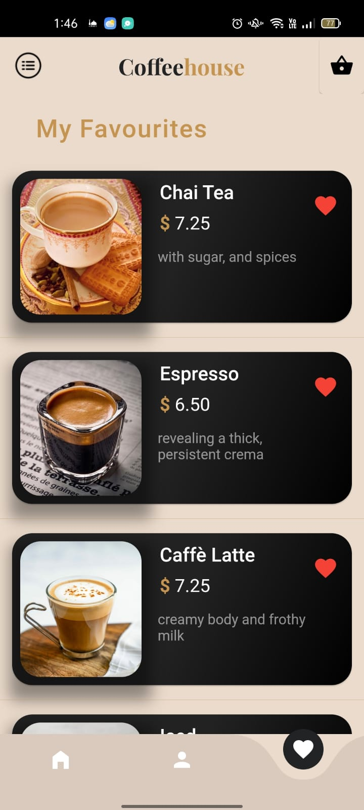</td>
  <td>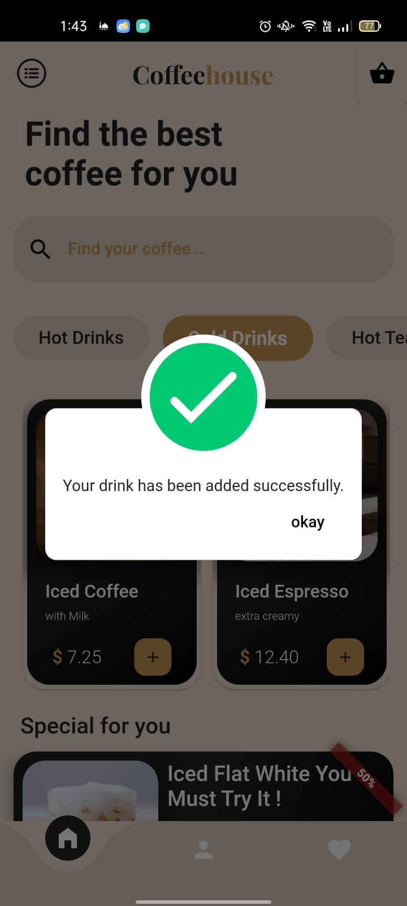</td>
</tr>
<tr>
  <td>Shopping Cart</td>
  <td>Favorites Screen</td>
  <td>Animations</td>
</tr>

<tr>
  <td>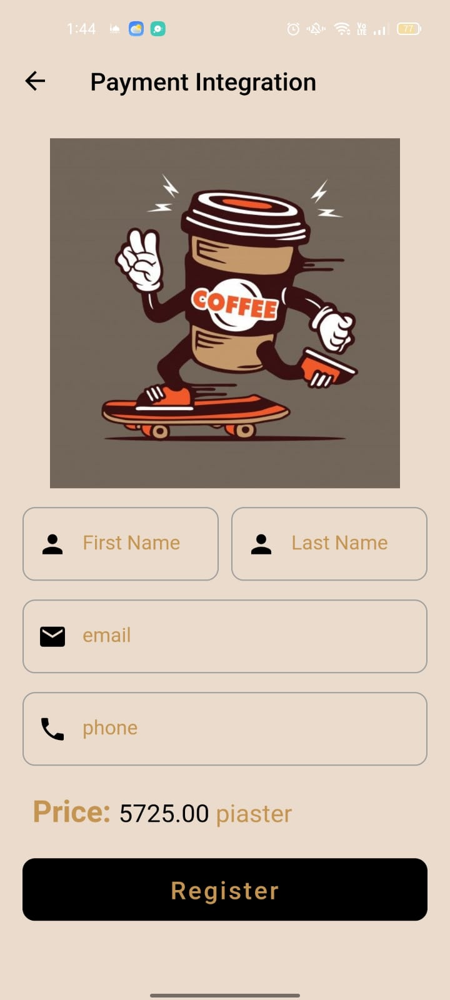</td>  
  <td>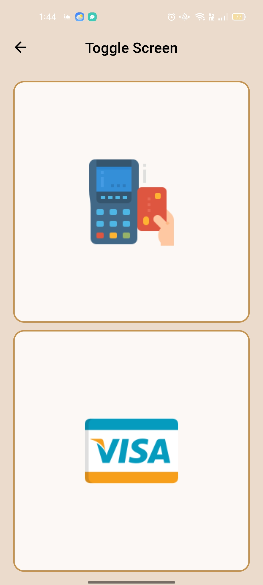</td>
  <td>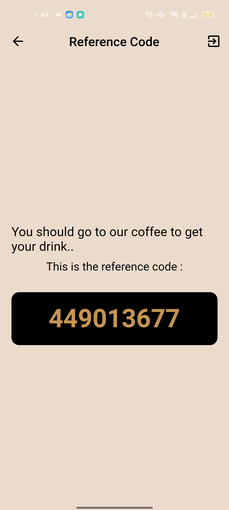</td>
  <td>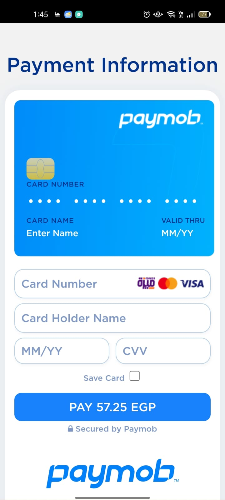</td>  
</tr>
<tr>
  <td>Paymob Checkout 1</td>
  <td>Paymob Checkout 2</td>
  <td>Paymob Checkout 3</td>
  <td>Paymob Checkout 4</td>  
</tr>
</table>

---

## 🛠️ Built With
This project leverages advanced libraries for a professional-grade finish:

* **Firebase Core/Auth:** Secure user authentication and cloud integration.
* **Flutter Bloc (Cubit):** Robust state management for global app states.
* **Paymob Gateway:** Integrated payment processing for real transactions.
* **Flutter Zoom Drawer:** A specialized 3D perspective sidebar menu.
* **Curved Navigation Bar:** Modern, animated bottom navigation.
* **Animations Package:** Smooth container transforms and shared axis transitions.
* **Dio:** For handling efficient network requests.
* **Google Fonts:** Custom typography (Popppins/Roboto).

---

## ✨ Key Features
* **Authentication:** Full Login/Logout flow using Firebase Authentication.
* **Interactive Menu:** An animated Zoom Drawer that provides a unique navigation feel.
* **State Management:** Cubit handles the cart logic, favorite toggling, and UI theme states.
* **Real-world Payments:** Integration with the Paymob API to simulate/process coffee orders.
* **Enhanced UX:** Uses `blurrycontainer` and `introduction_screen` for a modern aesthetic.
* **Responsive UI:** Built with `SafeArea` and flexible layouts to support various screen sizes.

---

## 💻 Technical Setup

1. **Clone the repository:**
   ```bash
   git clone https://github.com/ahmed-mohamed74/coffee_shop.git